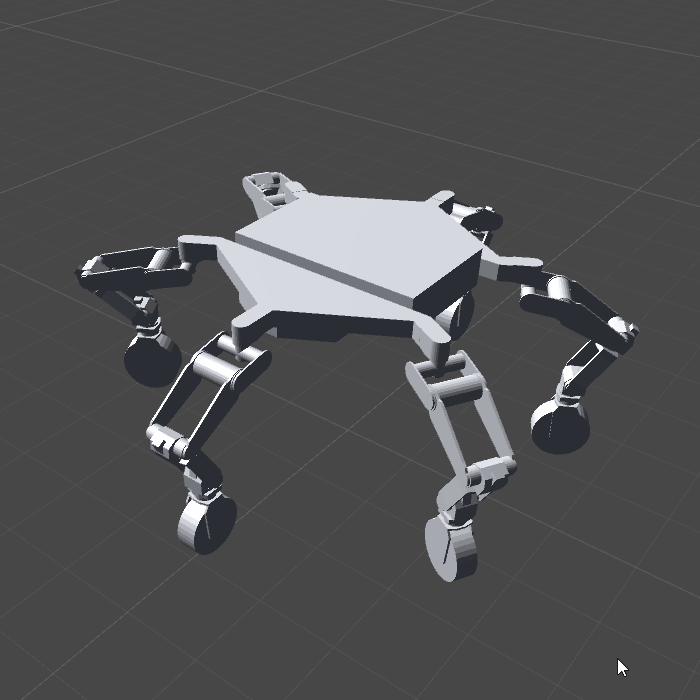

# unity urdf-loader

Utilities for loading URDF files and STL geometry into Unity



## Use
```cs
StreamReader reader = new StreamReader(".../path/to/urdf");
string content = reader.ReadToEnd();
URDFJointList ujl = URDFParser.BuildRobot(".../package/dir", content);
```

### API
#### URDFParser
##### LoadURDFRobot(string package, string urdfpath, loadmeshFunction)
TODO

##### BuildRobot(package, urdfcontent, loadMeshFunction)
TODO

#### URDFJointList
##### SetAngle(name, rad)
TODO

##### TrySetAngle
TODO

##### GetAnglesAsDictionary()
TODO

##### SetAnglesFromDictionary()
TODO

# LICENSE

The software is available under the [Apache V2.0 license](../LICENSE.txt).

Copyright © 2018 California Institute of Technology. ALL RIGHTS
RESERVED. United States Government Sponsorship Acknowledged. Any 
commercial use must be negotiated with with Office of Technology 
Transfer at the California Institute of Technology. This software may 
be subject to U.S. export control laws. By accepting this software, 
the user agrees to comply with all applicable U.S. export laws and 
regulations. User has the responsibility to obtain export licenses, 
or other export authority as may be required before exporting such 
information to foreign countries or providing access to foreign 
persons. Neither the name of Caltech nor its operating division, the
Jet Propulsion Laboratory, nor the names of its contributors may be
used to endorse or promote products derived from this software 
without specific prior written permission.
